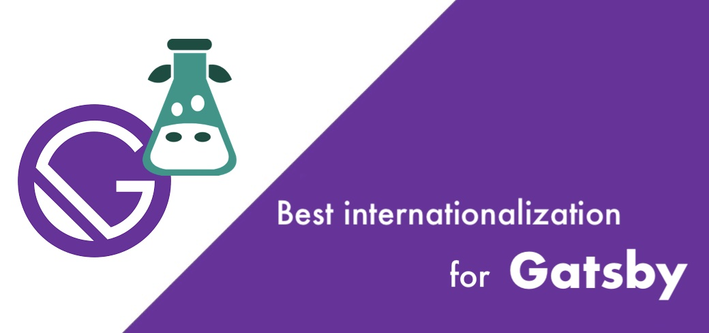

# Introduction

## What is react-i18next?

react-i18next is a powerful **internationalization** framework for [**React**](https://reactjs.org) / [**React Native**](https://reactnative.dev/) which is based on [**i18next**](https://www.i18next.com). Check out the [history of i18next](https://www.i18next.com/misc/the-history-of-i18next) and [when react-i18next was introduced](https://www.i18next.com/misc/the-history-of-i18next#v2).


You should read the [i18next](https://www.i18next.com) documentation. The [configuration options](https://www.i18next.com/overview/configuration-options) and translation functionalities like [plurals](https://www.i18next.com/translation-function/plurals), [formatting](https://www.i18next.com/translation-function/formatting), [interpolation](https://www.i18next.com/translation-function/interpolation), ... are documented there.


The module provides multiple components eg. to assert that needed translations get loaded or that your content gets rendered when the language changes.



react-i18next is optimally suited for **server-side rendering**. It provides extra extension point to work with next.js, for e.g. [Learn more](legacy-v9/serverside-rendering.md).

As react-i18next depends on [i18next](http://i18next.com) you can use it in any other UI framework and on the server-side (node.js, .net, ...) too. Like the React philosophy - just:

> **Learn once - translate everywhere**.


Check out [this video](https://youtu.be/37rcHVcQ6t0) and the corresponding [blog post](https://www.locize.com/blog/how-to-easily-add-i18n-to-your-software) about "Vite + React + TypeScript" with i18next.





[Here](https://locize.com/blog/react-i18next/) you'll find a simple tutorial on how to best use react-i18next.\
Some basics of i18next and some cool possibilities on how to optimize your localization workflow.[\
](https://locize.com/blog/react-i18next/)



**Using Next.js?**\
[Here](https://locize.com/blog/next-i18next/) you'll find a blog post on how to best use [next-i18next](https://github.com/i18next/next-i18next) with [client side translation download](https://github.com/i18next/next-i18next#client-side-loading-of-translations-via-http) and SEO optimization.

[](https://locize.com/blog/next-i18next/)\
\
**Using Next.js with the new App Router?**\
Then [this article](https://www.locize.com/blog/i18n-next-app-router) is what you are looking for!

[](https://www.locize.com/blog/i18n-next-app-router)



**Using Remix?**\
[Here](https://github.com/locize/locize-remix-i18next-example) you'll find a simple example and [here a step by step tutorial](https://locize.com/blog/remix-i18n/) on how to best use remix-i18next.

[](https://locize.com/blog/remix-i18n/)



**Using Gatsby?**\
[Here](https://github.com/locize/locize-gatsby-example) you can find an example and an appropriate [blog post](https://locize.com/blog/gatsby-i18n/).

[](https://locize.com/blog/gatsby-i18n/)


## What does my code look like

**Before:** Your React code would have looked something like:

```jsx
...
<div>Just simple content</div>
<div>
  Hello <strong title="this is your name">{name}</strong>, you have {count} unread message(s). <Link to="/msgs">Go to messages</Link>.
</div>
...
```

**After:** With the `Trans` component just change it to:

```jsx
...
<div>{t('simpleContent')}</div>
<Trans i18nKey="userMessagesUnread" count={count}>
  Hello <strong title={t('nameTitle')}>{{name}}</strong>, you have {{count}} unread message(s). <Link to="/msgs">Go to messages</Link>.
</Trans>
...
```

If you prefer not using semantic keys but text - [that's also possible](https://www.i18next.com/principles/fallback.html#key-fallback).

## On top: [Localization as a service](https://locize.com)

i18next supports translation management tools such as [locize.com](http://locize.com/?utm_source=react_i18next_com\&utm_medium=gitbook).


[Here](https://github.com/locize/react-tutorial) you can find a step by step guide, which will unleash the full power of i18next in combination with locize.\
See how your developer experience with this localization workflow [could look like](https://youtu.be/osScyaGMVqo).\
There's also the possibility to have an [even more focused developer experience](https://youtu.be/VfxBpSXarlU), with the help of the [auto-machinetranslation workflow](https://docs.locize.com/whats-inside/auto-machine-translation) and the use of the save missing keys functionality, new keys not only gets added to locize automatically, while developing the app, but are also [automatically translated](https://youtu.be/VfxBpSXarlU) into the target languages using machine translation (like [Google Translate](https://cloud.google.com/translate)).




[Learn more about the enterprise offering](https://www.i18next.com/overview/for-enterprises)
