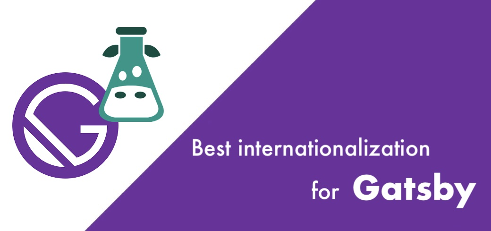

# SSR (additional components)

## Using [Next.js](https://nextjs.org/)?

You should have a look at [next-i18next](https://github.com/i18next/next-i18next) which extends react-i18next to bring it to Next.js the easiest way.

Since `next-i18next@v16`, both **App Router** and **Pages Router** are supported within a single package — no boilerplate needed. The library provides `getT()` for Server Components, `useT()` for Client Components, and automatic language detection via proxy/middleware.

> [Here](https://www.locize.com/blog/next-i18next-v16/?utm_source=react_i18next_com\&utm_medium=gitbook\&utm_campaign=latest_ssr) you can read about all the improvements in next-i18next v16.
>
> [Here](https://github.com/locize/next-i18next-locize) you can also find a next-i18next app example in combination with locize.
>
> **Looking for an optimized Next.js translations setup?**\
> [Here](https://www.locize.com/blog/next-i18next/?utm_source=react_i18next_com\&utm_medium=gitbook\&utm_campaign=latest_ssr) you'll find a blog post on how to best use next-i18next with client side translation download and SEO optimization.
>
> [](https://www.locize.com/blog/next-i18next/?utm_source=react_i18next_com\&utm_medium=gitbook\&utm_campaign=latest_ssr)
>
> ***
>
> **Using SSG / `next export`?**\
> [Here](https://www.locize.com/blog/next-i18n-static/?utm_source=react_i18next_com\&utm_medium=gitbook\&utm_campaign=latest_ssr) you'll find a simple tutorial on how to best use next-i18next in a SSG environment.\
> [](https://www.locize.com/blog/next-i18n-static/?utm_source=react_i18next_com\&utm_medium=gitbook\&utm_campaign=latest_ssr)

## Using [Remix](https://remix.run)?

You should have a look at [remix-i18next](https://github.com/sergiodxa/remix-i18next) which extends react-i18next to bring it to Remix the easiest way.

> [Here](https://github.com/locize/locize-remix-i18next-example) you'll find a simple example and [here a step by step tutorial](https://www.locize.com/blog/remix-i18n/?utm_source=react_i18next_com\&utm_medium=gitbook\&utm_campaign=latest_ssr) on how to best use remix-i18next.
>
> [](https://www.locize.com/blog/remix-i18n/?utm_source=react_i18next_com\&utm_medium=gitbook\&utm_campaign=latest_ssr)

## Using [Gatsby](https://www.gatsbyjs.com/)?

You should have a look at [gatsby-plugin-react-i18next](https://github.com/microapps/gatsby-plugin-react-i18next) which extends react-i18next to bring it to Gatsby the easiest way.

> [Here](https://github.com/locize/locize-gatsby-example) you'll find a simple example and [here a step by step tutorial](https://www.locize.com/blog/gatsby-i18n/?utm_source=react_i18next_com\&utm_medium=gitbook\&utm_campaign=latest_ssr) on how to best use [gatsby-plugin-react-i18next](https://github.com/microapps/gatsby-plugin-react-i18next).
>
> [](https://www.locize.com/blog/gatsby-i18n/?utm_source=react_i18next_com\&utm_medium=gitbook\&utm_campaign=latest_ssr)

## Setting the i18next instance based on req

Use the [I18nextProvider](i18nextprovider.md) to inject the i18next instance for example bound to the http i18n instance on the request object using [i18next-http-middleware](https://github.com/i18next/i18next-http-middleware).

```jsx
<I18nextProvider i18n={req.i18n}>
  <App />
</I18nextProvider>
```

## Passing initial translations / initial language down to client

To avoid asynchronous loading of translation on the client side (and the possible Suspense out of that) you will need to pass down initialLanguage (will call changeLanguage on i18next) and initialI18nStore (will prefill translations in i18next store).

### using the useSSR hook

```jsx
import React from 'react';
import { useSSR } from 'react-i18next';

export function InitSSR({ initialI18nStore, initialLanguage }) {
  useSSR(initialI18nStore, initialLanguage);

  return <App />
}
```

### using the withSSR HOC

```jsx
import React from 'react';
import { withSSR } from 'react-i18next';
import App from './App';

const ExtendedApp = withSSR()(App);

<ExtendedApp initialLanguage={} initialI18nStore={} />
```

The ExtendedApp in this case will also have the composed `ExtendedApp.getInitialProps()`
